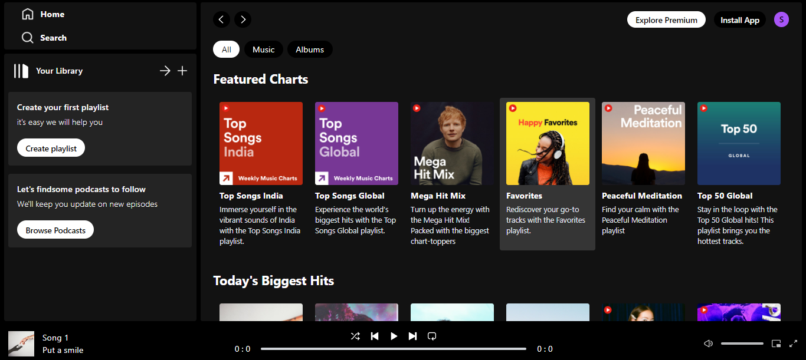

# Tunes Online Music Website 🎵

A dynamic and user-friendly online music website built with the MERN stack, featuring a music player, album listings, and an admin panel for managing songs and albums.



## Tech Stack


## Table of Contents 📚
- [Features](#features)
- [Installation](#installation)
- [Usage](#usage)

## Features ✨

- **Music Player 🎧**: Play, pause, skip tracks, and adjust volume.
- **Album Listings 📀**: Browse through various albums, view album details, and listen to songs.
- **Admin Panel 🛠️**: Admin panel for adding, updating, and deleting songs and albums.


## Installation 🛠️

1. **Clone the repository:**
   ```bash
   git clone https://github.com/SachindaBandara/Music-website-using-ReactJS-NodeJS-ExpressJS-MongoDB.git

2. **Navigate to the project directory:**
   ```bash
   cd Music-website-using-ReactJS-

3. **Install dependencies for the backend:**
   ```bash
   cd backend
   npm install

4. **Install dependencies for the frontend:**
   ```bash
   cd ../musicWeb
   npm install

5. **Setup Environment Variables:** Create a .env file in the backend directory
   ```bash
    CLOUDINARY_NAME = ""
    CLOUDINARY_API_KEY = ""
    CLOUDINARY_SECRET_KEY = ""
    MONGODB_URI = ""

## Usage 🚀

1. **Run the backend server:**
   ```bash
   cd backend
   npm run server

2. **Run the frontend development server:**
   ```bash
   cd ../musicWeb
   npm run dev
   
3. **Access the website:** Open your browser and go to http://localhost:5173 to view and interact with the music site.

4. **Run the admin panel development server:**
   ```bash
   cd ../admin
   npm run dev

##
## 🤝Happy coding!💻
